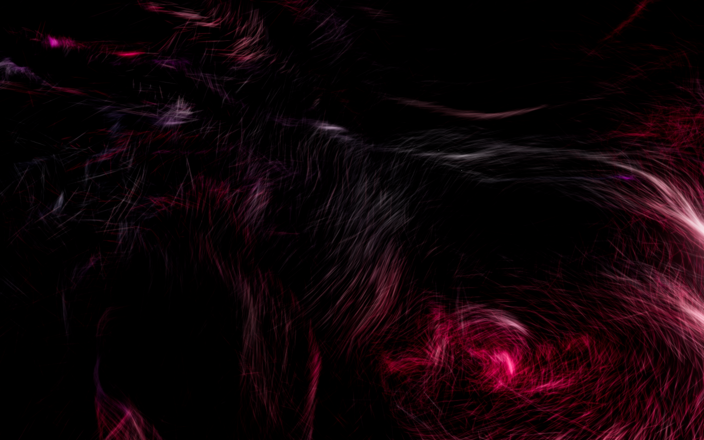

# FlowScreen

A procedural GPU screensaver for Windows 11. Tens of thousands of short glowing
fibers are advected through a layered curl-noise field, forming slow organic
waves, folds and vortices on deep black.



*1920×1200, 123,904 fibers, 57 FPS on integrated Intel UHD graphics.*

The simulation and the rendering both run entirely on the GPU. The CPU never
touches particle data: per frame the host issues **two draw calls for the whole
scene** — one to integrate every fiber, one to draw every fiber — plus a fixed
post chain of about thirteen fullscreen passes.

---

## Contents

- [Requirements](#requirements)
- [Install](#install)
- [Screensaver arguments](#screensaver-arguments)
- [Settings](#settings)
- [Development](#development)
- [Build](#build)
- [Architecture](#architecture)
- [How the effect works](#how-the-effect-works)
- [Performance](#performance)
- [Known limitations](#known-limitations)
- [License](#license)

---

## Requirements

**To run**

| | |
|---|---|
| OS | Windows 10 1809+ / Windows 11, x64 |
| GPU | Anything with WebGL2 and `EXT_color_buffer_float` (all GPUs from ~2015 on) |
| Runtime | [.NET 8 Desktop Runtime](https://dotnet.microsoft.com/download/dotnet/8.0) |
| Runtime | [Microsoft Edge WebView2 Runtime](https://developer.microsoft.com/microsoft-edge/webview2/) — preinstalled on Windows 11 |

**To build**

| | |
|---|---|
| SDK | [.NET 8 SDK](https://dotnet.microsoft.com/download/dotnet/8.0) |
| SDK | [Node.js 20.19+ or 22.12+](https://nodejs.org/) |

---

## Install

```powershell
pwsh scripts/build.ps1
pwsh scripts/install.ps1
```

`install.ps1` needs **no administrator rights** and touches nothing outside your
user profile:

- files go to `%LOCALAPPDATA%\FlowScreen\app`
- three standard values are written under `HKCU\Control Panel\Desktop`:
  `SCRNSAVE.EXE` (the full path to `FlowScreen.scr`), `ScreenSaveActive`, and
  `ScreenSaveTimeOut` (only when you pass `-TimeoutMinutes`)

These are exactly the values the Screen Saver control panel writes itself.

```powershell
pwsh scripts/install.ps1 -TimeoutMinutes 5   # also set the idle timeout
pwsh scripts/install.ps1 -System             # also copy to System32 (needs admin)
pwsh scripts/uninstall.ps1                   # reverses everything
pwsh scripts/uninstall.ps1 -Purge            # ...and deletes settings and logs
```

`-System` exists only because Windows enumerates the Screen Saver Settings
dropdown from `%SystemRoot%\System32` and `%SystemRoot%` alone. Without it
FlowScreen still works and is still shown as the *selected* screensaver, but it
will not appear in that dropdown list. `uninstall.ps1` only clears
`SCRNSAVE.EXE` when it still points at FlowScreen, so a screensaver you selected
afterwards is left alone.

Because the renderer bundle is embedded in the executable as a managed resource,
`FlowScreen.scr` is a **single self-contained 2.6 MB file** — which is what makes
the System32 install possible at all.

---

## Screensaver arguments

`FlowScreen.scr` is a byte-for-byte copy of `FlowScreen.exe`; Windows identifies
a screensaver purely by the extension.

| Argument | Behaviour |
|---|---|
| `/s` | Full screen on every display |
| `/c`, `/c:HWND` | Settings dialog |
| `/p HWND`, `/p:HWND` | Miniature preview inside the given window |
| `/a`, `/a:HWND` | Obsolete password dialog — opens settings |
| `/debug` | Settings dialog with the statistics overlay forced on |
| *(none)* | Settings dialog |

All of these are accepted case-insensitively, with `/`, `-` or `--`, with the
handle inline after `:` or `=` or as the next argument, and in decimal or `0x`
hex. Handles beyond `int.MaxValue` are handled — 64-bit HWNDs routinely exceed
it. The full matrix is covered by [`CommandLineParserTests`](tests/FlowScreen.Tests/CommandLineParserTests.cs).

> **Note when testing by hand:** launching a `.scr` through `Start-Process` or
> Explorer goes via ShellExecute, and the shell's registered `scrfile` verb
> **replaces your arguments with `/S`**. Use `FlowScreen.exe`, or start the
> process with `UseShellExecute = false`, when you want to pass `/c` or `/p`.

### Exiting

The screensaver closes on any key, any mouse button, the scroll wheel, or a
pointer movement of **more than 8 pixels from where the cursor was when the
saver started**. There is also a 900 ms grace period at startup.

Both of those exist because the cheap version of this feature — quit on any
`WM_MOUSEMOVE` — makes a screensaver that dies instantly to an optical mouse
resting on a textured desk.

Input is observed twice over, because either path can be unavailable:
low-level Win32 hooks (which see input even while WebView2 holds focus, and work
before the first frame), and messages posted by the renderer page itself (for
when the OS refuses to install hooks).

---

## Settings

Stored as JSON at `%LOCALAPPDATA%\FlowScreen\settings.json`. A corrupt or
partially written file never fails the app: it is copied aside as
`settings.corrupt.json`, defaults are used, and every field is clamped into
range on both load and save. Writes are atomic.

| Setting | Values | Default |
|---|---|---|
| Effect | Fiber Flow | Fiber Flow |
| Particle density | Low 25,600 · Medium 65,536 · High 123,904 · Ultra 230,400 | High |
| Speed | 0.1× – 3× | 1× |
| Fiber length | 0.2× – 3× | 1× |
| Glow | 0× – 2× | 1× |
| Trail | 0 – 0.95 | 0.85 |
| Palette | Pink · Purple · Blue · Cyber · Monochrome · Custom (6 stops) | Pink |
| Frame rate | 30 · 60 · 120 · Unlimited | 60 |
| VSync | on / off | on |
| Render scale | 50% · 75% · 100% | 100% |
| Adaptive quality | Off · Balanced · Performance | Balanced |
| Multiple monitors | Synchronized · Independent | Synchronized |
| Random world each launch | on / off | on |
| Seed | 0 – 2147483646 | 12345 |
| Performance overlay | on / off | off |

The settings dialog runs the **real renderer** in a live preview. Most changes
are pushed into it over the WebView message channel without a reload; only the
seed (baked into the procedural world when the effect is constructed) and VSync
(a browser-process command-line switch) restart it.

**Trail** is a look control, not a second exposure control: temporal persistence
accumulates energy, so at 0.85 a static fiber would end up roughly six times
brighter than a single frame. The renderer divides that back out, and the frame
keeps the same overall brightness at any trail length.

Logs are written to `%LOCALAPPDATA%\FlowScreen\logs\` (7-day retention, 2 MB
roll).

---

## Development

The renderer has no dependency on anything Windows-specific and runs standalone
in any browser.

```bash
cd src/renderer
npm install
npm run dev          # http://127.0.0.1:5173
```

Useful query parameters when running standalone:

```
?debug=1                 statistics overlay
?density=ultra           low | medium | high | ultra
?palette=cyber           pink | purple | blue | cyber | mono
?seed=12345              fixed seed (otherwise randomised)
```

Press <kbd>D</kbd> in the browser to toggle the overlay.

**Debug builds of the host load `http://127.0.0.1:5173` instead of the embedded
bundle**, so the usual loop is two terminals:

```bash
# terminal 1
cd src/renderer && npm run dev

# terminal 2
dotnet run --project src/windows/FlowScreen -- /c
```

Checks:

```bash
cd src/renderer
npm run typecheck    # tsc --noEmit, strict
npm run lint         # eslint

dotnet test          # 37 tests: argument parsing, settings, wire format
```

---

## Build

```powershell
pwsh scripts/build.ps1
```

One command does everything: `npm ci` → `tsc --noEmit && vite build` → copy
`dist/` into the Windows project → `dotnet publish` (single-file) → copy
`FlowScreen.exe` to `FlowScreen.scr`. Output lands in `build/`.

```powershell
pwsh scripts/build.ps1 -SkipRenderer          # reuse the existing bundle
pwsh scripts/build.ps1 -Configuration Debug   # dev-server build
pwsh scripts/build.ps1 -SingleFile $false     # plain folder publish
```

---

## Architecture

```
FlowScreen.scr  (= FlowScreen.exe, one self-contained file)
│
├── CommandLine ....... /s /c /p, all spellings
├── Settings .......... strongly typed model, atomic JSON, clamped on load+save
├── Interop ........... monitors, window styles, low-level input hooks, DWM
├── Input ............. movement threshold + grace period
├── Screensaver ....... one window per display, shared WebView2 environment
├── Views ............. SaverWindow · PreviewWindow · ConfigWindow
└── Hosting
    └── WebView2  ──►  embedded Vite bundle, served from https://flowscreen.assets/
                       │
                       └── FiberFlow renderer (TypeScript · three.js · WebGL2)
                           ├── FlowFieldController  vortices, slow parameter drift
                           ├── FiberSimulation      MRT ping-pong, 1 draw call
                           ├── FiberRenderer        instanced SDF capsules, 1 draw call
                           ├── CameraRig            non-repeating drift, view offset
                           └── PostPipeline         trail → dual-filter bloom → ACES
```

```
src/
├── renderer/                     # standalone, no Windows dependency
│   └── src/
│       ├── app/                  # render loop, perf monitor, adaptive quality, overlay
│       ├── audio/                # AudioSource interface (reserved, currently silent)
│       ├── config/               # settings contract, palettes, density presets
│       ├── core/                 # PRNG, logging, host bridge, fullscreen quad
│       ├── effects/
│       │   ├── Effect.ts         # the interface future effects implement
│       │   └── fiberflow/
│       ├── post/                 # HDR pipeline
│       └── shaders/
│           ├── lib/              # common · noise · curl · flowField
│           ├── sim/              # fullscreen.vert · simulate.frag · seed.frag
│           ├── fiber/            # fiber.vert · fiber.frag
│           └── post/             # trail · bloom{Prefilter,Downsample,Upsample} · composite
└── windows/FlowScreen/           # WPF host
```

**Why WPF and not WinUI 3.** WinUI 3 needs the Windows App SDK bootstrapper
alongside the executable and has no clean story for re-parenting a window into
another process's HWND — which is exactly what `/p` requires. WPF is a single
framework-dependent executable that does both.

**Why the renderer is embedded rather than shipped as a folder.** Windows only
lists screensavers found directly in System32. A folder of loose assets could
never go there, so the Vite output is compiled into the assembly as manifest
resources and served to WebView2 through `WebResourceRequested` from a synthetic
`https://flowscreen.assets/` origin. (An `https` origin, not `file://`, so ES
modules and WebGL2 behave exactly as they do under the dev server.)

**Multi-monitor.** One borderless window per display, positioned with
`SetWindowPos` in *physical* pixels rather than WPF's DIPs — under per-monitor
DPI those two coordinate systems disagree, and the mismatch shows up as a window
that misses the edge of a scaled secondary display. The manifest declares
PerMonitorV2.

*Synchronized* mode is more than a shared seed. Every window gets the same seed
and the same wall-clock epoch, and its camera calls
`setViewOffset(virtualWidth, virtualHeight, monitorX, monitorY, monitorWidth, monitorHeight)`
so all displays render slices of **one continuous frustum**. Fibers cross the
bezel and line up on the next screen. *Independent* mode gives each display its
own world.

---

## How the effect works

### The flow field

Motion comes from **curl noise** — the curl of a vector potential, which is
divergence-free by construction. That is the single most important choice in the
whole effect: a divergence-free field neither compresses the fibers into point
sinks nor blows them apart into uniform mist, so the motion reads as *fluid*
rather than as random drift, and sheets, folds and vortices appear for free.

Layered from coarse to fine ([`flowField.glsl`](src/renderer/src/shaders/lib/flowField.glsl)):

| Layer | Purpose |
|---|---|
| 0 · domain warp | Bends the sampling space itself. Destroys the recognisable "simplex blobs" signature and creates creases — warping the *input* produces folds where adding to the output would only blur. |
| 1 · macro curl | 4D simplex, so structures morph in place instead of sliding past the camera. Sampled anisotropically (`p * vec3(1, 1.9, 1)`); squashing the noise along Y stratifies the flow, which is what turns "smoke" into "hair". |
| 2 · meso curl | Turbulence giving the ribbons internal texture. |
| 3 · micro curl | 3D (cheaper) — at this scale the eye cannot distinguish morphing from sliding. |
| 4 · vortex cells | Four slowly drifting rotational attractors with Gaussian falloff. |
| 5 · sheet attraction | A `tanh`-saturated pull toward one huge undulating surface. Saturated, not linear: a linear spring overwhelms the curl field for any fiber more than a couple of units off the sheet and points it straight at the camera, which turns silky flow into a bed of spikes. |
| 6 · containment | Soft walls, so nothing escapes the working volume. |

The fourth noise dimension is driven by unbounded time, and every vortex centre,
axis, strength and radius rides its own sine with a period between 60 and 900
seconds. The periods are mutually incommensurate, so the composite state never
revisits itself in any practical viewing session.

### Simulation

State lives in two RGBA32F textures ping-ponging between two multiple-render-target
framebuffers:

```
attachment 0 :  xyz = position,  w = life
attachment 1 :  xyz = velocity,  w = colour coordinate
```

Writing both attachments from one fragment shader halves the pass count compared
to the usual one-FBO-per-attribute GPGPU layout, so integrating up to 230,400
fibers is **one draw call**.

Fibers do not snap to the field, they lag it — that inertia is what bends each
path into a smooth arc instead of a polyline. Respawning is branchless: an `if`
would diverge inside every warp containing a single dying fiber and cost more
than always evaluating both paths.

The colour coordinate is a large-scale scalar field advected with each fiber, so
neighbours share a hue and the image gets broad colour regions instead of
confetti.

### Rendering

One `InstancedBufferGeometry` quad, `instanceCount` fibers, **one draw call**.
The vertex shader reads each fiber's state from the simulation textures and
expands the quad into a camera-facing capsule oriented along the velocity. The
fragment shader evaluates that capsule analytically as a signed distance in
half-width units, so fibers stay smooth at any resolution — no MSAA, no
`GL_LINES`, no edge stair-stepping.

Two details do most of the work:

- **Sub-pixel width compensation.** Distant fibers are widened to a ~0.8 px
  minimum and dimmed by exactly the area that was added. Energy is preserved, so
  the far field keeps the right brightness instead of shimmering as fibers cross
  pixel centres.
- **The density mask.** Two octaves of very low-frequency noise decide where
  fibers may exist at all, with a floor rather than a hard cut — a binary mask
  makes the covered fraction of the frame swing as the field drifts, so the
  composition would periodically empty out. Dimming instead of deleting keeps a
  faint background layer everywhere, which also supplies the depth haze.

### Post

```
scene RT (persistence) → prefilter → down ×N → up ×N (additive) → composite
```

Bloom is a progressive dual-filter chain (13-tap downsample, 9-tap tent
upsample, six mips) rather than a pair of separable Gaussians. It approximates a
very wide, very smooth glow for about the cost of two fullscreen passes, and it
does not flicker on small bright features — which is all a field of thin fibers
is made of.

The composite applies a **black-point toe**, `x²/(x+k)`, before ACES tone
mapping. Additive fibers plus a wide bloom will happily lift the whole frame to
a dull pink haze; the toe pushes everything below the threshold back to *exact*
zero, which is what keeps 40–70% of the image at true black on an OLED panel. A
one-LSB dither follows the sRGB encode, because deep magenta-to-black gradients
band badly without it and banding is the fastest way to make a slow gradient
look cheap.

---

## Performance

Measured on **integrated Intel UHD Graphics** — deliberately, as a worst case.
A discrete gaming GPU has a great deal of headroom over these numbers.

| Density | Fibers | Resolution | FPS | Adaptive quality |
|---|---:|---|---:|---|
| High | 123,904 | 1920×1200 | 57.6 | off |
| Medium | 65,536 | ~1080p window | 60 (capped) | off |
| Ultra | 230,400 | ~1080p window | 47 → holds 60 | steps to 62% fibers, 0.85 scale |

Draw calls per frame: **17 total** — 1 simulation, 1 for every fiber, 1 trail,
1 bloom prefilter, 5 downsample, 5 upsample, 1 composite, plus 2 for clears.

Design constraints that keep it there: no per-frame allocations anywhere in the
render loop (the statistics window is a preallocated `Float32Array`, the overlay
writes `nodeValue` on existing text nodes), no CPU particle loops at all, and
adaptive quality that sheds population before resolution — at 60% of the fibers
the composition is unchanged, whereas at 60% resolution every fiber loses its
crisp edge.

Chromium aggressively throttles timers and `requestAnimationFrame` in windows it
believes are backgrounded or occluded, and a borderless full-screen window over
the taskbar trips that heuristic. The host passes
`--disable-background-timer-throttling`, `--disable-renderer-backgrounding`,
`--disable-backgrounding-occluded-windows` and
`--disable-features=CalculateNativeWinOcclusion` to prevent it.

---

## Known limitations

- **Multi-monitor is untested on real hardware.** The code paths are complete —
  per-display windows, physical-pixel placement, per-monitor DPI, negative
  virtual-desktop coordinates, and the synchronized view offset — but the
  development machine has a single display, so only the single-monitor path has
  been exercised end to end.
- **VSync off is best-effort.** A page cannot disable vsync from inside
  `requestAnimationFrame`; only the compositor can. The setting is applied as
  `--disable-gpu-vsync --disable-frame-rate-limit` on the WebView2 environment,
  and whether it takes effect depends on the driver.
- **The preview is a real render, and starts in about a second.** It is not
  instantaneous: a WebView2 process has to spin up first. Until it does, the
  preview shows a black panel with the FlowScreen wordmark.
- **The renderer is not reinitialised after a lost GPU context.** It reports the
  loss to the host, which ends the session rather than leaving a frozen frame on
  screen — a frozen screensaver is indistinguishable from a hung machine.
- **Density changes rebuild the simulation**, which drops the current fiber
  population. Visible as a brief dissolve in the settings preview.
- **Audio reactivity is not implemented.** The plumbing is: bass / mid / treble /
  volume reach `uAudio` in both shaders every frame, and adding a real source
  means implementing the one-method `AudioSource` interface — no shader or effect
  change.
- **x64 only.** No ARM64 build is produced.

---

## Extending

`Effect` ([`effects/Effect.ts`](src/renderer/src/effects/Effect.ts)) is the seam
for new visuals. An effect owns a scene, a camera and its own GPU state, and
answers `applySettings` / `resize` / `setQualityScale` / `update`. The app shell,
the post pipeline, the adaptive-quality controller and the whole Windows host are
independent of which one is running. `FiberFlowEffect` is the only implementation
today; Liquid, Galaxy and AudioReactive would drop in beside it.

---

## License

MIT — see [LICENSE](LICENSE). Bundles three.js (MIT) and Ashima Arts /
Stefan Gustavson's simplex noise (MIT).
